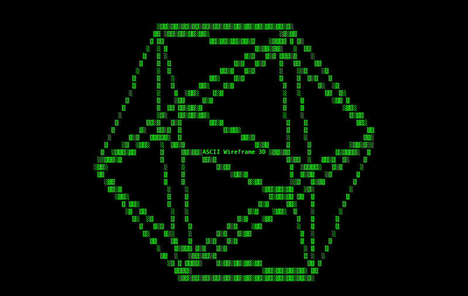

# ascii-wireframe-3d

ASCII wireframe renderer for 3D polyhedra. Great for websites. I use it on [alexrichter.xyz](https://alexrichter.xyz).

**Live demo available [here](https://alexrichterxyz.github.io/ascii-wireframe-3d/)**

.

## Usage

```js
import Wireframe3D from "./wireframe-3d.js";

const w = new Wireframe3D(document.getElementById("canvas"), {
  shape: "icosahedron", // one of cube, torus, tetrahedron, octahedron, dodecahedron, or icosahedron
  vertices: null, // custom vertices
  edges: null, // custom edges
  width: 80, // number of horizontal characters
  height: 40, // number of vertical characters
  scale: 1.0, // scale factor of user-provided vertices
  speed: { x: 0.0009, y: 0.0015, z: 0 }, // rotation speed per axis
  chars: "░▒▒", // characters cycled along edges
  vertexChar: null, // character drawn at vertices
  text: "ASCII Wireframe 3D", // centered overlay text
  mouse: true, // mouse interaction enabled
  touch: true, // touch interaction enabled
  autoSpin: true, // resume spinning after mouse interaction
  spinDelay: 1000, // ms before auto-spin resumes
  lock: { x: false, y: false, z: false }, // which axes are frozen
  sensitivity: 0.005, // sensitivity to mouse movement or touch
  angle: { x: 0, y: 0, z: 0 }, // initial angle
});
```
